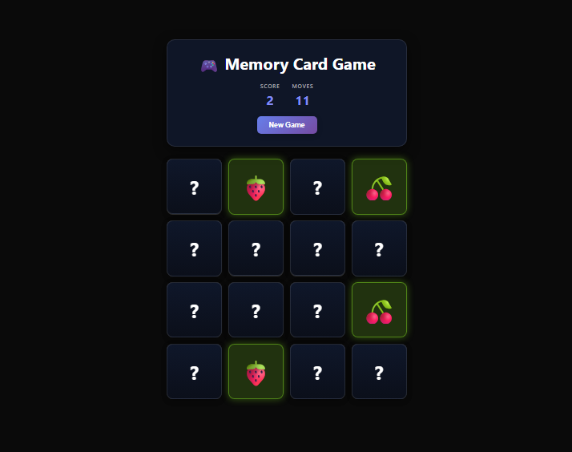

# 🎮 Memory Card Game

A simple and interactive memory card matching game built with React.  
Flip cards, match pairs, track your score, and complete the game with the fewest moves possible.

---

## 🚀 Live Demo

[Live Demo]([https://memory-card-game.com](https://memory-card-game-teal-nine.vercel.app/)

---

## 📸 Preview



---

## ✨ Features

- Card flipping animation
- Match detection logic
- Score tracking
- Move counter
- Win message
- Restart game functionality
- Shuffled cards every new game
- Built with reusable React components
- Custom Hook for game logic

---

## 🛠️ Technologies Used

- React
- JavaScript (ES6+)
- CSS3
- React Hooks

---

## 📂 Project Structure

```bash
src
│── Components
│   ├── Card.jsx
│   ├── GameHeader.jsx
│   └── WinMessage.jsx
│
│── Hooks
│   └── useGameLogic.js
│
│── App.jsx
│── index.css
```

---

## 🧠 What I Learned

- Managing complex state using custom hooks
- Working with React state and effects
- Building reusable UI components
- Handling game logic and user interaction
- Array shuffling algorithms
- Conditional rendering in React

---

## ⚙️ Installation

```bash
# Clone the repository
git clone https://github.com/your-username/memory-card-game.git

# Navigate to project folder
cd memory-card-game

# Install dependencies
npm install

# Start development server
npm run dev
```

---

## 👨‍💻 Author

Developed by Bahaa Medhat

- GitHub: [github.com/BahaaMedhat1](https://github.com/BahaaMedhat1)
- LinkedIn: [linkedin.com/in/bahaa-wanas-9797b923a](https://www.linkedin.com/in/bahaa-wanas-9797b923a/)
